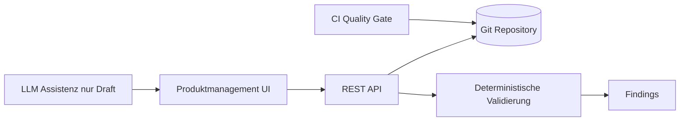

# Nomos

Nomos ist eine **Git-first Plattform für Produktmanagement, Anforderungsmanagement und deterministische Regelvalidierung** im Kontext von Provisionierung.

Der aktuelle Stand im Repository bildet die **fachliche und architektonische Grundlage für MVP 0.1**: Das Projekt fokussiert bewusst auf strukturierte Artefakte, nachvollziehbare Änderungen über Git sowie Governance- und Review-Prozesse – noch ohne vollständige Runtime für BPMN/DMN/Skills.

## Warum es Nomos gibt

In vielen Organisationen liegt produktnahes Wissen verteilt in Tickets, Tabellen, Einzel-Dokumenten und implizitem Teamwissen. Nomos adressiert genau dieses Problem, indem es fachliche Inhalte als versionierbare, reviewbare Artefakte strukturiert.

Ziele von MVP 0.1:
- Produktwissen konsistent und versioniert verwalten.
- Anforderungen und Business Rules klar trennen.
- Validierungen deterministisch und reproduzierbar ausführen.
- Findings, Versionen und Entscheidungsgrundlagen auditierbar machen.

## Projektumfang (MVP 0.1)

### In Scope
- Strukturierte Artefakte für:
  - Produkte und Produktvarianten
  - Anforderungen
  - Business Rules
  - Validierungsszenarien
  - Findings
- Git-basierter Change- und Review-Prozess (Branch, Commit, PR, Merge)
- Konzeptionelle REST-API und UI für produktnahes Arbeiten
- Optionale, strikt assistive KI-Unterstützung (Drafts)

### Out of Scope
- BPMN-/DMN-Runtime
- Generische Skill-Runtime
- Autonome KI-Entscheidungen
- Direkte Zielsystem-Provisionierung
- Vollständige Event-Architektur und Enterprise-Betriebsmodell

## Leitprinzipien

- **Git als Source of Truth** für fachliche Artefakte.
- **Governance by default**: keine Umgehung von Reviews/Freigaben.
- **Determinismus** in der fachlichen Validierung.
- **Business-Lesbarkeit** der Modelle (YAML/strukturierte Artefakte).
- **Sichere KI-Nutzung**: nur Vorschläge, niemals autoritative Freigabe/Entscheidung.

## Fachliches Modell (vereinfacht)

Nomos trennt bewusst zwischen:
- Produkt & Produktvariante
- Anforderung
- Business Rule
- Validierungsszenario
- Finding

Weitere Artefakttypen wie Entscheidung, Prozess, Task, Skill, Zielsystem und Nachweis sind im Zielbild vorbereitet, aber im MVP nur begrenzt bzw. konzeptionell enthalten.

## Architektur auf hoher Ebene



Kernidee: Fachliche Änderungen laufen immer über einen kontrollierten Git-Workflow mit Review und Nachvollziehbarkeit.

## Governance & Arbeitsweise

Empfohlener MVP-Workflow:
1. Änderungsvorschlag (Branch/Workspace) erstellen.
2. Artefakte bearbeiten.
3. Validierung lokal oder in CI ausführen.
4. Commit erzeugen.
5. Pull Request als Review-Antrag öffnen.
6. Findings beheben.
7. Freigeben und mergen.

Kritische Änderungen (z. B. Rule-Logik, Severity, Freigaberegeln) unterliegen erhöhter Reviewstrenge.

## REST-API- und UI-Zielbild (konzeptionell)

Es gibt konzeptionelle API-Gruppen für:
- Product Catalogue
- Requirements
- Rules
- Validation
- Git Workspace
- AI Assistance
- Governance/Review

Die UI ist auf Fachnutzer ausgelegt und übersetzt Git-Begriffe in Business-Sprache (z. B. „Änderungsvorschlag“ statt Branch).

## KI-Assistenz in Nomos

KI ist in MVP 0.1 optional und assistiv:
- erlaubt: Drafts für Anforderungen/Regeln, Szenario-Vorschläge, Erklärungen
- nicht erlaubt: autonome Entscheidungen, Freigaben, Governance-Umgehung, Main-Branch-Schreibzugriffe

Damit bleibt die fachliche Autorität bei Menschen, deterministischer Validierung und Governance.

## Roadmap nach MVP-Start

Die Dokumentation beschreibt eine phasenweise Umsetzung:
1. Dokumentations-/Architekturfundament
2. Repository- und Artefaktgrundlage
3. Backend Foundation
4. Git Workspace Handling
5. Produktmanagement-UI
6. Validierungsengine MVP
7. KI-Assistenz MVP
8. Hardening & Governance

## Repository-Struktur (aktuell)

```text
/docs/architecture
  000-013: Architektur, Scope, Domain-/Artefaktmodell,
           Governance, KI-, API- und UI-Konzept, Roadmap, Handover,
           Technologie-Stack (012) und Dev/Prod-Umgebung (013)

/docs/concepts
  Fachkonzept- und Metamodell-Dokumente (aus PDF in Markdown überführt)

/deploy
  docker-compose fuer Dev und Prod, .env.example,
  Reverse-Proxy-Konfiguration und Deploy/Rollback-Skripte
```

## Referenzprodukt

Als roter Faden dient „**Benutzerkonto mit Mailbox**“ (Varianten intern/extern/privilegiert), um Modellierung, Regeln, Validierung und Governance nachvollziehbar zu demonstrieren.

## Hinweis zum Reifegrad

Dieses Repository enthält aktuell primär **Konzepte und Architekturgrundlagen** für MVP 0.1. Die technische Implementierung wird gemäß Roadmap in nachfolgenden Phasen aufgebaut.
