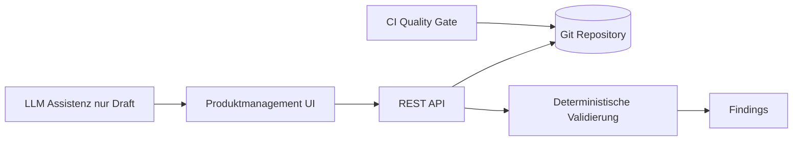

# Nomos

Nomos ist eine **Git-first Plattform für Produktmanagement, Anforderungsmanagement und deterministische Regelvalidierung** im Kontext von Provisionierung.

Der aktuelle Stand im Repository bildet die **fachliche und architektonische Grundlage für MVP 0.1** und enthält bereits eine erste lauffähige CLI-Basis. Das Projekt fokussiert bewusst auf strukturierte Artefakte, nachvollziehbare Änderungen über Git sowie Governance- und Review-Prozesse – noch ohne vollständige Runtime für BPMN/DMN/Skills.

## Warum es Nomos gibt

In vielen Organisationen liegt produktnahes Wissen verteilt in Tickets, Tabellen, Einzel-Dokumenten und implizitem Teamwissen. Nomos adressiert genau dieses Problem, indem es fachliche Inhalte als versionierbare, reviewbare Artefakte strukturiert.

Ziele von MVP 0.1:
- Produktwissen konsistent und versioniert verwalten.
- Anforderungen und Business Rules klar trennen.
- Validierungen deterministisch und reproduzierbar ausführen.
- Findings, Versionen und Entscheidungsgrundlagen auditierbar machen.

## Projektumfang (MVP 0.1)

### In Scope
- Strukturierte Artefakte für:
  - Produkte und Produktvarianten
  - Anforderungen
  - Business Rules
  - Validierungsszenarien
  - Findings
- Git-basierter Change- und Review-Prozess (Branch, Commit, PR, Merge)
- Konzeptionelle REST-API und UI für produktnahes Arbeiten
- Erste CLI-Funktionalitäten zur lokalen Arbeit mit Cosmos-/Domain-/Service-Strukturen
- Optionale, strikt assistive KI-Unterstützung (Drafts)

### Out of Scope
- BPMN-/DMN-Runtime
- Generische Skill-Runtime
- Autonome KI-Entscheidungen
- Direkte Zielsystem-Provisionierung
- Vollständige Event-Architektur und Enterprise-Betriebsmodell

## Leitprinzipien

- **Git als Source of Truth** für fachliche Artefakte.
- **Governance by default**: keine Umgehung von Reviews/Freigaben.
- **Determinismus** in der fachlichen Validierung.
- **Business-Lesbarkeit** der Modelle (YAML/strukturierte Artefakte).
- **Sichere KI-Nutzung**: nur Vorschläge, niemals autoritative Freigabe/Entscheidung.

## Fachliches Modell (vereinfacht)

Nomos trennt bewusst zwischen:
- Produkt & Produktvariante
- Anforderung
- Business Rule
- Validierungsszenario
- Finding

Weitere Artefakttypen wie Entscheidung, Prozess, Task, Skill, Zielsystem und Nachweis sind im Zielbild vorbereitet, aber im MVP nur begrenzt bzw. konzeptionell enthalten.

## Architektur auf hoher Ebene


```mermaid
flowchart LR
    PM[Produktmanagement UI] --> API[REST API]
    API --> GIT[(Git Repository)]
    API --> VAL[Deterministische Validierung]
    VAL --> FIND[Findings]
    CI[CI Quality Gate] --> GIT
    AI[LLM Assistenz nur Draft] --> PM
```

Kernidee: Fachliche Änderungen laufen immer über einen kontrollierten Git-Workflow mit Review und Nachvollziehbarkeit.

## Aktueller Implementierungsstand

Derzeit vorhanden:
- Dokumentations- und Architekturgrundlage unter `docs/`
- Erste Go-CLI (`nomos`) für lokale Strukturverwaltung und Basiskommandos
- Basis-Deploy/Dev-Struktur für Backend/Frontend im Repository

CLI-Schnellstart:

```bash
go run ./cmd/nomos --help
go run ./cmd/nomos cosmos init ./tmp/demo-cosmos --git
go run ./cmd/nomos validate --path ./tmp/demo-cosmos
```

Eine vollständige CLI-Referenz befindet sich in [`docs/cli-usage.md`](docs/cli-usage.md).

## Governance & Arbeitsweise

Empfohlener MVP-Workflow:
1. Änderungsvorschlag (Branch/Workspace) erstellen.
2. Artefakte bearbeiten.
3. Validierung lokal oder in CI ausführen.
4. Commit erzeugen.
5. Pull Request als Review-Antrag öffnen.
6. Findings beheben.
7. Freigeben und mergen.

Kritische Änderungen (z. B. Rule-Logik, Severity, Freigaberegeln) unterliegen erhöhter Reviewstrenge.

## REST-API- und UI-Zielbild (konzeptionell)

Es gibt konzeptionelle API-Gruppen für:
- Product Catalogue
- Requirements
- Rules
- Validation
- Git Workspace
- AI Assistance
- Governance/Review

Die UI ist auf Fachnutzer ausgelegt und übersetzt Git-Begriffe in Business-Sprache (z. B. „Änderungsvorschlag“ statt Branch).

## KI-Assistenz in Nomos

KI ist in MVP 0.1 optional und assistiv:
- erlaubt: Drafts für Anforderungen/Regeln, Szenario-Vorschläge, Erklärungen
- nicht erlaubt: autonome Entscheidungen, Freigaben, Governance-Umgehung, Main-Branch-Schreibzugriffe

Damit bleibt die fachliche Autorität bei Menschen, deterministischer Validierung und Governance.

## Roadmap nach MVP-Start

Die Dokumentation beschreibt eine phasenweise Umsetzung:
1. Dokumentations-/Architekturfundament
2. Repository- und Artefaktgrundlage
3. Backend Foundation
4. Git Workspace Handling
5. Produktmanagement-UI
6. Validierungsengine MVP
7. KI-Assistenz MVP
8. Hardening & Governance

## Repository-Struktur (aktuell)

Das Nomos-Source-Repository ist **kein konkretes Cosmos-Repository**. Es enthält Anwendungscode, Dokumentation, Tests, Templates, Skripte und Beispiele; mutable Cosmos-Daten liegen in einem separaten Workspace unter `.nomos/`.

```text
nomos/
  cmd/
  internal/
  docs/
  examples/
  scripts/
  deploy/
  frontend/
  backend/
```

Ein Cosmos-Workspace sieht dagegen so aus:

```text
my-cosmos/
  .nomos/
    cosmos.yaml
    domains/
    catalog/
    servicegraphs/
    evidence/
    index/
    cache/
  README.md
```

Für ein dediziertes Cosmos-Repository sollte nur generierter lokaler Zustand ignoriert werden (`.nomos/cache/`, `.nomos/index/`). Wenn Nomos nur lokal innerhalb eines anderen Repositories verwendet wird, kann stattdessen die gesamte `.nomos/` ignoriert werden.

## Referenzprodukt

Als roter Faden dient „**Benutzerkonto mit Mailbox**“ (Varianten intern/extern/privilegiert), um Modellierung, Regeln, Validierung und Governance nachvollziehbar zu demonstrieren.

## Hinweis zum Reifegrad

Dieses Repository enthält aktuell primär **Konzepte und Architekturgrundlagen** für MVP 0.1 sowie eine erste technische Grundlage (inklusive CLI). Die weitere technische Umsetzung wird gemäß Roadmap in nachfolgenden Phasen ausgebaut.

## Building the CLI with version metadata

Local development build:

```bash
make build
```

Inspect version output:

```bash
./bin/nomos version
./bin/nomos version --short
./bin/nomos version --format json
```

Build with explicit version:

```bash
make build VERSION=v0.1.0
```

Release-style build (sets `builtBy=release`):

```bash
make release-build VERSION=v0.1.0
```

Version fields:
- `version`: semantic version (`vMAJOR.MINOR.PATCH`) or `dev`
- `commit`: short git commit hash (or `none` outside git)
- `date`: UTC build timestamp
- `dirty`: `true`/`false` in a git work tree, otherwise `unknown`
- `builtBy`: build origin (`source`, `release`, `ci`, ...)
- `go`: Go runtime version
- `os/arch`: target OS and architecture

Recommended SemVer evolution:
- `v0.1.x`: early local CLI and Cosmos bootstrap behavior
- `v0.2.x`: improved artifact model and validation
- `v0.3.x`: HTTP API/server improvements
- `v1.0.0`: stable CLI and artifact format

## Running the Nomos Web UI

`./bin/nomos serve --path /tmp/nomos-demo --listen 127.0.0.1:8080`

Pages: `/`, `/domains`, `/graph`, `/validate`.

`/domains` is now an explorer-style tree view (Cosmos → Domains → Services) with a detail pane and contextual creation actions. For normal domain creation, select a parent node and enter only the new segment. Nomos composes the canonical namespace. Advanced mode allows full canonical input.

Example: selected parent `blumer.cloud`, new segment `test2`, created domain `test2.blumer.cloud`. The displayed tree path is `cloud / blumer / test2`.

Selection can be deep-linked with query parameters:
- `/domains`
- `/domains?selected=domain:identity.blumer.cloud`
- `/domains?selected=service:identity.blumer.cloud/user-account`
API: `/health`, `/api/v1/cosmos`, `/api/v1/domains`, `/api/v1/graph`, `/api/v1/validate`.
Read-only MVP over filesystem-backed Cosmos.

## Go-served Web UI

The read-only Nomos Web UI is served directly by `nomos serve` using embedded Go templates and static assets (`html/template` + `embed`). It mirrors the existing Nomos frontend visual language (sidebar, topbar, cards, tables, badges) without requiring Node, React, or Vite at runtime.

```bash
make build
./scripts/create-demo-cosmos.sh /tmp/nomos-demo
./bin/nomos serve --path /tmp/nomos-demo --listen 127.0.0.1:8080
```

Open `http://127.0.0.1:8080`.


## Blueprint relationships in the demo cosmos

The demo Product Blueprint `PROD-ACC-MBX-001` (`Benutzerkonto mit Mailbox`) declares `offered_by`, optional `owning_domain`, and `fulfillment.required_services` so product ownership and cross-domain fulfillment are explicit. It keeps legacy `required_service_blueprints`/`required_services` for backward compatibility. Each fulfillment entry maps a concrete domain service, such as `cloud.blumer.identity/user-account` or `cloud.blumer.collaboration/license-assignment`, to the service capability used for provisioning it. Service Blueprints expose the reverse context with `namespace_service_ref`.

## CLI/REST parity and namespace display

Nomos keeps canonical DNS-like domain names for storage, CLI arguments and REST routes, for example `identity.blumer.cloud` remains stored under `.nomos/domains/identity.blumer.cloud/` and is addressed via `GET /api/v1/domains/identity.blumer.cloud`.

For presentation, the shared namespace utilities also expose tree-oriented metadata: `identity.blumer.cloud` becomes `cloud / blumer / identity` with the tree key `cloud/blumer/identity` and leaf label `identity`. The Go Web UI `/domains` page uses this tree display while still showing the canonical namespace in the details pane.

The read-only CLI and REST API now share the same DTOs and application use cases:

| CLI command | REST endpoint |
| --- | --- |
| `nomos cosmos info --format json` | `GET /api/v1/cosmos` |
| `nomos domain list --format json` | `GET /api/v1/domains` |
| `nomos domain get <domain> --format json` | `GET /api/v1/domains/{domain}` |
| `nomos service list --domain <domain> --format json` | `GET /api/v1/domains/{domain}/services` |
| `nomos service get <service> --domain <domain> --format json` | `GET /api/v1/domains/{domain}/services/{service}` |
| `nomos blueprint list --format json` | `GET /api/v1/blueprints` |
| `nomos blueprint show <id> --format json` | `GET /api/v1/blueprints/{id}` |
| `nomos graph` | `GET /api/v1/graph` |
| `nomos validate --format json` | `GET /api/v1/validate` |
| `nomos namespace tree --format json` | `GET /api/v1/namespaces` |

Common JSON namespace metadata looks like:

```json
{
  "canonical": "identity.blumer.cloud",
  "treePath": "cloud/blumer/identity",
  "displayPath": "cloud / blumer / identity",
  "leaf": "identity"
}
```

Shared read-side error codes include `COSMOS_MISSING`, `COSMOS_LOAD_FAILED`, `DOMAIN_NOT_FOUND`, `SERVICE_NOT_FOUND`, `VALIDATION_FAILED`, `INVALID_FORMAT`, `INVALID_NAMESPACE` and `INTERNAL_ERROR`.

## Go-served Web UI

Nomos now includes a server-rendered Go web UI for browsing and managing a local Cosmos repository without introducing a primary database or a separate frontend build chain. Start it with:

```bash
./bin/nomos serve --path /tmp/nomos-demo --listen 127.0.0.1:8080
```

The UI exposes a dashboard, Cosmos doctor checks, domain and service explorers, namespace tree, Mermaid graph, validation findings, verification evidence, blueprint browsing, instance browsing, and an API index. Domain and service creation are supported through contextual forms and the matching API endpoints; verification writes the same `.nomos/evidence` files as the CLI. On `/domains`, normal creation is guided by the selected tree node: select a parent domain or namespace, choose **Add child domain**, enter only a segment such as `test2`, and review the live canonical preview before submitting. Creating a new top-level domain remains available from the page header/root panel, while **Advanced: create by canonical name** remains available for power users who intentionally want to type the full canonical namespace. All data remains file-first and Git-first in the selected Cosmos path.
