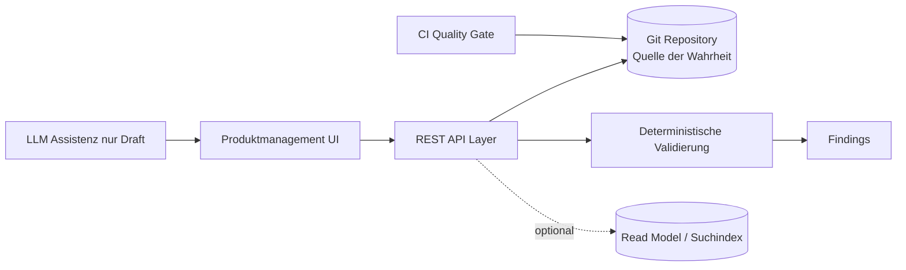

# 000 - Architekturüberblick für MVP 0.1

## Zweck des Dokuments
Dieses Dokument beschreibt den Rahmen der Plattform und grenzt MVP 0.1 klar vom langfristigen Zielbild ab.

## Warum diese Plattform existiert
Produktnahe Provisionierungslogik ist in vielen Organisationen verteilt auf Tickets, Tabellen, Einzeldokumente und implizites Wissen. Das fuehrt zu inkonsistenten Entscheidungen, hoher Abstimmungslast und geringer Nachvollziehbarkeit. Die Plattform soll dieses Wissen als strukturierte Artefakte in einem Git Repository fuehrbar machen.

## Problemstellung
- Produktwissen ist oft nicht versioniert und nicht reviewbar.
- Anforderungen und Business Rules sind nicht sauber voneinander getrennt.
- Validierung vor Freigabe ist uneinheitlich.
- Auditfähigkeit entsteht spaet statt von Anfang an.

## Leitidee: Strukturierte Produktartefakte
Die Plattform trennt bewusst:
- Produkt und Produktvariante,
- Anforderung,
- Business Rule,
- Entscheidung,
- Prozess,
- Task,
- Skill,
- Zielsystem,
- Validierung und Findings.

Diese Trennung erhoeht Verstaendlichkeit, Governance und Wiederverwendbarkeit.

## Warum MVP 0.1 bewusst kleiner ist
Das Ziel von MVP 0.1 ist nicht maximale Funktionstiefe, sondern ein tragfähiges Fundament mit klaren Regeln für Versionierung, Review und Validierung. Komplexe Themen wie Orchestrierungslaufzeit, generische Skill-Ausfuehrung oder vollstaendige Ereignisarchitektur werden spaeter behandelt.

## Git-first als Arbeitsmodell
MVP 0.1 setzt auf Git-first:
- Git ist Quelle der Wahrheit für fachliche Artefakte.
- Branch entspricht einem Änderungsvorschlag.
- Commit entspricht einem Speicherpunkt.
- Pull Request entspricht einem Review-Antrag.
- Merge in den Hauptbranch entspricht einer Freigabe.

Dadurch werden Nachvollziehbarkeit, Reviewbarkeit und reproduzierbare Versionen von Anfang an sichergestellt.

## Bezug zur Zukunft
Aufbauend auf dem MVP können spaeter folgen:
- Anbindung an Orchestrierungsplattformen wie Pega oder Power Platform,
- Read Model oder Suchindex für performante Abfragen,
- erweiterte Deterministik für Entscheidungs- und Prozesskontexte,
- KI-gestuetzte Assistenz für Draft-Erstellung.

## Was MVP 0.1 beweisen soll
- Produktwissen kann in Git als strukturierte Artefakte sauber verwaltet werden.
- Anforderungen und Business Rules können konsistent validiert werden.
- Findings und Versionen sind nachvollziehbar.
- Governance über Review und Freigabe funktioniert für Fach- und Technikrollen.

## Klare Nicht-Ziele
MVP 0.1 ist **kein** Provisionierungsruntime.
MVP 0.1 ist **keine** Workflow Engine.
MVP 0.1 ist **keine** generische Rule Engine für alle Enterprise-Entscheidungen.
MVP 0.1 ist eine **Produktmanagement- und Validierungsplattform** für strukturierte Produkt-, Anforderungs- und Regelartefakte.

## High-Level Architektur

## Referenzprodukt als roter Faden
Als Beispiel dient "Benutzerkonto mit Mailbox" mit Varianten für intern, extern und privilegiert. Das Beispiel erklärt die Architekturentscheidungen, ohne die Plattform auf dieses eine Produkt zu beschraenken.
