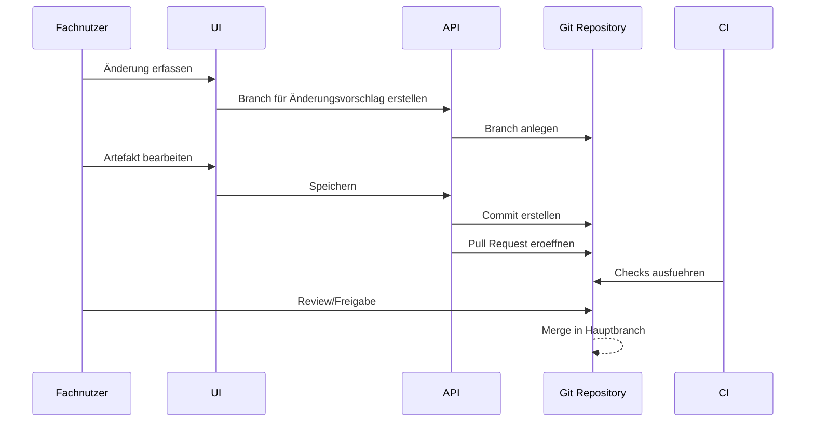

# 002 - Git-first Architektur

## Zweck
Beschreibung, warum Git im MVP 0.1 die Quelle der Wahrheit für fachliche Artefakte ist.

## Kernprinzip
Git Repository = autoritative Quelle der Wahrheit für Produkt-, Anforderungs-, Regel- und Validierungsartefakte.

## Welche Artefakte in Git liegen
- Produkt
- Produktvariante
- Anforderung
- Business Rule
- Validierungsszenario
- vorbereitete Artefakte für Entscheidung, Prozess, Task, Skill, Zielsystem, Qualitätskriterium

## Warum YAML für MVP 0.1
- Hohe Lesbarkeit für Fach- und Technikrollen.
- Gute Diffbarkeit in Pull Requests.
- Strukturierbar für spaetere JSON Schema Validierung.

## Git Mapping auf Governance
- Branch -> Änderungsvorschlag
- Commit -> Speicherpunkt
- Pull Request -> Review-Antrag
- Merge -> freigegebene Änderung
- Historie -> Audit und Nachvollziehbarkeit

## CI als Qualitätsgate
Vor Merge prueft CI konzeptionell:
- Struktur- und Schema-Konformitaet,
- Referenzintegritaet,
- Status- und Metadatenregeln,
- grundlegende Validierungschecks.

## Warum keine primäre Datenbank in MVP 0.1
Ein relationales Modell waere zusätzliche Komplexitaet ohne unmittelbaren Mehrwert für das initiale Ziel: versionierte, reviewbare Fachartefakte. Ein Read Model oder Runtime Store kann spaeter ergänzt werden, bleibt aber abgeleitet und nicht autoritativ.

## Vergleich: PostgreSQL-first vs Git-first
| Kriterium | PostgreSQL-first | Git-first (MVP Empfehlung) |
|---|---|---|
| Versionierung | zusätzlich zu bauen | nativ über Commit Historie |
| Audit | separate Audit-Mechanik notwendig | nativ über Commit + PR |
| Review | externes Reviewmodell notwendig | Pull Request Workflow integriert |
| Suche | stark mit Indexen | optional über spaeteren Suchindex |
| Gleichzeitiges Editieren | transaktional stark | branchbasiert, konfliktauflösung in Git |
| Business Lesbarkeit | indirekt über UI | direkte YAML Lesbarkeit |
| AI Nutzbarkeit | Extraktion aus DB notwendig | direkte Artefaktdateien nutzbar |
| Betriebsaufwand | DB Betrieb sofort notwendig | geringerer Startaufwand |
| MVP Fit | niedriger | hoch |
| Zukunftserweiterung | möglich, aber migrationsintensiv | Read Model schrittweise ergänzbar |

## Empfohlene Zielarchitektur für MVP
- Git = authoritative source of truth
- API = kontrollierter Zugriff und Validierungsschicht
- UI = businessfreundliche Bearbeitungsschicht
- CI = automatisches Qualitätsgate
- Optional Read Model = abgeleiteter Such-/Query Index
- Optional Runtime Store = spaetere technische Laufzeitdaten

## Nicht als autoritative Git Artefakte speichern
- temporäre UI Sessions
- Chat Historie
- Runtime Logs
- jedes einzelne Validierungsergebnis
- User Tokens
- Secrets
- technische Caches

## Git-first Workflow

