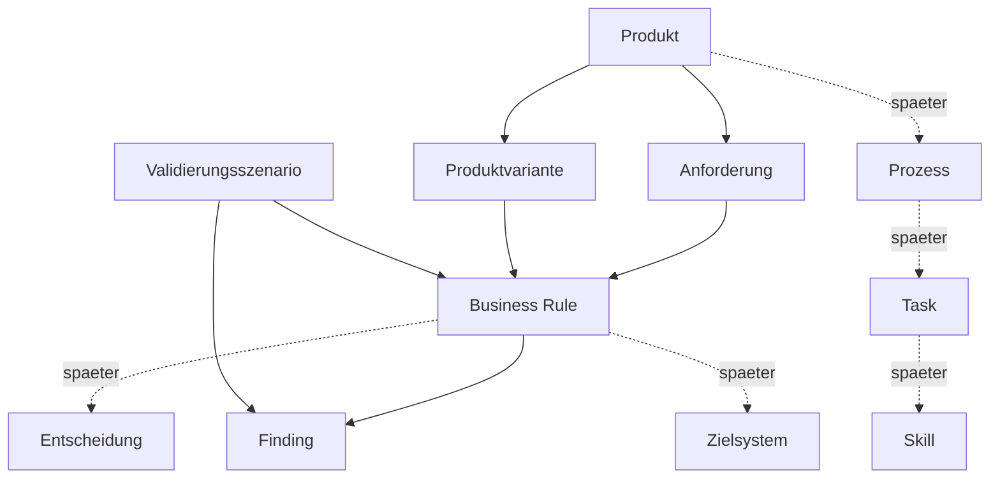

# 003 - Fachliches Domain-Modell

## Zweck
Dieses Dokument beschreibt das Metamodell der Plattform und die Relevanz der Artefakttypen für MVP 0.1 und das Zielbild.

## Relevanzkennzeichnung
- **MVP Pflicht**: in MVP 0.1 zwingend
- **Vorbereitet**: strukturell vorgesehen, aber nicht voll operationalisiert

## Artefakttypen
### Produkt (MVP Pflicht)
- Zweck: Fachliches Angebot beschreiben.
- Typische Attribute: id, name, version, owner, status, summary.
- Beispiel: Benutzerkonto mit Mailbox.
- Beziehungen: hat Produktvarianten, referenziert Anforderungen und Regeln.
- Zukunft: Basis für breiten Produktkatalog.

### Produktvariante (MVP Pflicht)
- Zweck: Auspraegung eines Produkts.
- Attribute: variante, berechtigungskontext, gültigkeit.
- Beispiel: intern, extern, privilegiert.
- Beziehungen: gehoert zu Produkt; aktiviert spezifische Regeln.

### Anforderung (MVP Pflicht)
- Zweck: Fachliche Erwartung in klarer Form.
- Beispiel: Externe Nutzer benötigen Enddatum.
- Beziehungen: wird durch Business Rules konkretisiert.

### Business Rule (MVP Pflicht)
- Zweck: Deterministische Pruefregel.
- Beispiel: Privilegierte Konten brauchen zusätzliche Freigabe.
- Beziehungen: referenziert Anforderung und Produktvariante.

### Validierungsszenario (MVP Pflicht)
- Zweck: Wiederverwendbarer Testfall.
- Beispiel: Externer Nutzer ohne Enddatum.
- Beziehungen: prueft Regeln gegen Beispielinput.

### Finding (MVP Pflicht)
- Zweck: Ergebnis einer Validierung.
- Attribute: severity, regelbezug, erklärung.
- Beziehungen: entsteht aus Regelpruefung.

### Entscheidung (Vorbereitet)
- Zweck: Fachliche Entscheidungspunkte modellieren.
- MVP: nur strukturell vorgesehen.

### Qualitätskriterium (Vorbereitet)
- Zweck: Messbare Qualitätsanforderung.
- MVP: für spaetere Reife vorgesehen.

### Prozess (Vorbereitet)
- Zweck: Abfolge fachlicher Schritte.
- MVP: keine Runtime-Ausfuehrung.

### Task (Vorbereitet)
- Zweck: Granulare Aktivitaet innerhalb eines Prozesses.
- MVP: nur Metamodellvorbereitung.

### Skill (Vorbereitet)
- Zweck: Fähigkeit, die spaeter orchestriert werden kann.
- MVP: keine generische Skill Runtime.

### Zielsystem (Vorbereitet)
- Zweck: Ziel technischer Provisionierung.
- MVP: Referenzierbar, aber keine Provisionierung.

### Nachweis (Vorbereitet)
- Zweck: Beleg für Regel, Entscheidung oder Finding.
- MVP: konzeptionell.

## Artefaktbeziehungen

## Referenzprodukt
"Benutzerkonto mit Mailbox" dient als Beispiel für die Pflichtartefakte in MVP 0.1:
- Varianten intern/extern/privilegiert,
- Anforderungen zu Person, Nutzertyp, Enddatum,
- Regeln für Tenant, Freigabe und Namenskonventionen,
- Findings als Validierungsergebnis.
