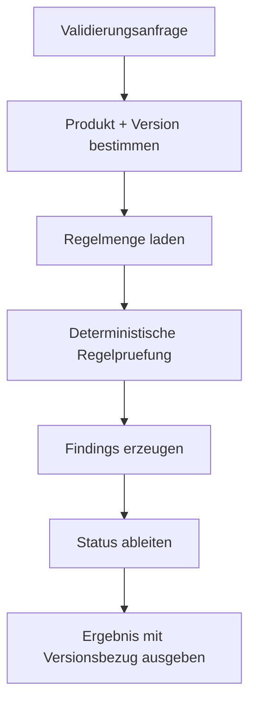

# 005 - Validierungskonzept

## Zweck
Definition der fachlichen Validierung in MVP 0.1.

## Was Validierung in MVP 0.1 bedeutet
Validierung prueft Eingabedaten deterministisch gegen freigegebene Business Rules für ein ausgewähltes Produkt und eine Produktversion.

## Abgrenzung
- Keine Provisionierungsausfuehrung.
- Keine autonome Entscheidungsfindung durch KI.
- Keine allgemeine Decision Runtime.

## Konzeptioneller Input
- ausgewähltes Produkt
- ausgewählte Produktversion
- Inputdaten
- optionaler Szenarioname
- optionaler Branch-Kontext

## Konzeptioneller Output
- validation_status
- passed_rules
- failed_rules
- findings
- evidence
- applied_product_version
- applied_rule_versions
- timestamp
- explanation

## Statuswerte für Validierung
- passed
- failed
- warning
- manual_clarification_required

## Severity für Findings
- info
- warning
- error
- blocking

## Deterministik als Pflicht
MVP 0.1 verlangt deterministische Auswertung freigegebener Regeldefinitionen. LLM Assistenz darf Drafts erzeugen, aber nicht die Runtime-Auslegung übernehmen.

## Nutzen von Validierungsszenarien
Validierungsszenarien helfen dem Produktmanagement, Regelwirkung transparent zu testen und zu kommunizieren.

## Beispielcases: Benutzerkonto mit Mailbox
1. **Gültiger interner Nutzer** -> erwartet `passed`.
2. **Externer Nutzer ohne Enddatum** -> erwartet `failed` mit `blocking` Finding.
3. **Privilegierter Nutzer ohne Zusatzfreigabe** -> erwartet `failed`.
4. **Mailbox ohne gültigen Tenant** -> erwartet `failed`.
5. **Doppelter Benutzername** -> Zukunftsszenario, spaeter mit Read Model oder Zielsystemabgleich.

## Validierungsfluss

