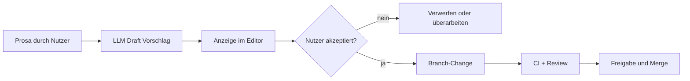

# 007 - KI-Assistenzkonzept

## Zweck
Rahmen für den sicheren Einsatz von LLM Assistenz in MVP 0.1.

## Grundsatz
KI ist optional und strikt assistiv. Autoritative Entscheidungen bleiben bei Menschen und deterministischer Plattformlogik.

## Erlaubte Fähigkeiten
- Draft-Anforderungen aus Prosa erzeugen.
- Draft-Business-Rules aus Prosa erzeugen.
- Fehlende Felder vorschlagen.
- Validierungsszenarien vorschlagen.
- Bestehende Regeln erklären.
- Inkonsistenzen aufzeigen.
- Änderungen zusammenfassen.

## Nicht erlaubte Fähigkeiten
- finale Provisionierungsentscheidungen treffen.
- Regeln freigeben.
- freigegebene Artefakte still ändern.
- Governance umgehen.
- Rules zur Laufzeit interpretieren.
- als autoritative Rule Engine agieren.
- direkt in Hauptbranch schreiben.

## Sicherer Workflow
1. Nutzer gibt Prosa ein.
2. LLM erzeugt Draft.
3. Draft wird in UI angezeigt.
4. Nutzer bearbeitet und akzeptiert oder verwirft.
5. Akzeptierter Draft wird normaler Branch-Change.
6. CI und Reviewer pruefen.
7. Nur freigegebene Änderungen werden gemergt.

## Leitprinzip
LLM erzeugt Vorschlaege.
Menschen reviewen.
Deterministische Validierung fuehrt freigegebene Artefakte aus.
Git dokumentiert Änderungen.
Governance gibt frei.

## Nachvollziehbarkeit und Datenschutz
- AI-gestuetzte Drafts sollen erkennbar sein.
- Akzeptierte Vorschlaege werden als normale Artefaktänderung versioniert.
- Sensible Prompts werden nicht standardmaessig in Git abgelegt.
- Keine Secrets oder unnötigen Personendaten an LLM übermitteln.

## KI-Draft-Workflow

