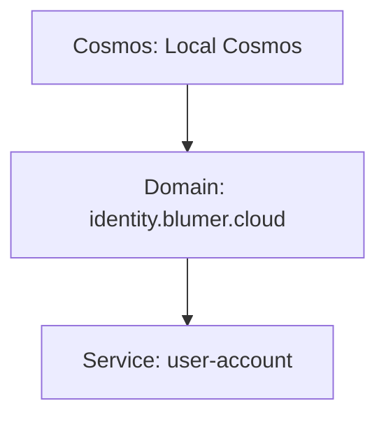

# CLI Usage (`nomos`)

Diese Seite dokumentiert die aktuelle Nutzung der Nomos-CLI auf Basis der implementierten Commands in `internal/cli/root.go`.

## Schnellstart

```bash
go run ./cmd/nomos --help
```

Version anzeigen:

```bash
go run ./cmd/nomos version
```

## Command-Übersicht

- `nomos version`
- `nomos cosmos init <path>`
- `nomos cosmos info [--path <dir>]`
- `nomos cosmos doctor [--path <dir>]`
- `nomos domain add <dns> [--path <dir>] [--owner <owner>] [--force]`
- `nomos domain list [--path <dir>]`
- `nomos service add <name> --domain <dns> [--path <dir>] [--owner <owner>] [--force]`
- `nomos validate [--path <dir>] [--format <text|json>]`
- `nomos graph [--path <dir>]`
- `nomos verify domain <dns> [--path <dir>]`
- `nomos serve [--path <dir>] [--listen <host:port>]`

---

## `nomos cosmos`

### `nomos cosmos init <path>`
Erzeugt eine neue lokale Cosmos-Struktur.

**Erstellt u. a. folgende Pfade:**
- `<path>/cosmos.yaml`
- `<path>/README.md`
- `<path>/domains/`
- `<path>/.nomos/cache/`
- `<path>/.nomos/index/`
- `<path>/.nomos/evidence/`

**Flags:**
- `--force`: erlaubt Initialisierung in nicht-leerem Zielverzeichnis.
- `--git`: führt `git init` im Zielverzeichnis aus und erzeugt zusätzlich `.gitkeep`.

**Beispiel:**
```bash
go run ./cmd/nomos cosmos init ./my-cosmos --force
```

### `nomos cosmos info`
Liest `cosmos.yaml` und gibt Kernfelder aus (`id`, `name`, `version`, `status`, `owner`, `domains`).
Die Domain-Anzahl wird aus dem Dateisystem ermittelt (`domains/*/domain.yaml`) und nicht aus einem statischen Feld in `cosmos.yaml`.

**Flag:**
- `--path` (Default: `.`)

### `nomos cosmos doctor`
Prüft Basiszustand:
- ob `cosmos.yaml` existiert
- ob ein `.git`-Ordner vorhanden ist

**Ausgabeverhalten:**
- Fehler bei fehlender `cosmos.yaml` (Exit-Code 1)
- Warnung, wenn Git nicht initialisiert ist

---

## `nomos domain`

### `nomos domain add <dns>`
Erzeugt eine Domain unter `domains/<dns>/`.

**Validierung:**
- DNS-Name muss mindestens einen Punkt enthalten (`.`), sonst Fehler.

**Erstellt:**
- `domains/<dns>/domain.yaml`
- `domains/<dns>/README.md`
- `domains/<dns>/services/`

**Flags:**
- `--path` (Default: `.`)
- `--owner` (Default: `unknown`)
- `--force` (überschreibt vorhandene Domain-Struktur)

### `nomos domain list`
Listet alle Unterordner unter `domains/`.

Flag: `--path` (Default: `.`).

---

## `nomos service`

### `nomos service add <name> --domain <dns>`
Erzeugt einen Service unter `domains/<dns>/services/<name>/`.

**Erstellt Unterordner:**
- `capabilities/`
- `requirements/`
- `rules/`
- `processes/`
- `skills/`
- `findings/`
- `evidence/`

**Zusätzlich:**
- `service.yaml`
- `README.md`

**Flags:**
- `--domain` (**pflichtig**)
- `--path` (Default: `.`)
- `--owner` (Default: `unknown`)
- `--force`

---

## `nomos validate`

Führt eine minimale Validierung aus.

Aktuell wird geprüft:
- Existenz von `cosmos.yaml`

**Ausgabe:**
- Text (Standard)
- JSON mit `--format json`

**Exit-Codes:**
- `0`: keine Findings
- `1`: mindestens ein Finding mit Fehler

Beispiel:

```bash
go run ./cmd/nomos validate --path . --format json
```

---

## `nomos graph`

Liest die Cosmos-Struktur aus dem Dateisystem und gibt eine Mermaid-Graph-Definition auf stdout aus:
- Cosmos-Knoten
- Domain-Knoten aus `domains/*/domain.yaml`
- Service-Knoten aus `domains/<domain>/services/*/service.yaml`

Beispielausgabe:



---

## `nomos verify`

### `nomos verify domain <dns>`
Prüft DNS-TXT-Record `_nomos.<dns>` auf den Inhalt `nomos-domain=<dns>`.

**Nebenwirkung:**
- schreibt ein Evidence-File nach `.nomos/evidence/<dns>-dns.yaml`

**Statuslogik:**
- `verified`, wenn erwarteter TXT-Inhalt gefunden wurde
- sonst `failed` und Befehl endet mit Fehler

**Flag:**
- `--path` (Default: `.`)

---

## `nomos serve`

Startet einen HTTP-Server.

**Flags:**
- `--path` (Default: `.`)
- `--listen` (Default: `127.0.0.1:8080`)

**Endpoints:**
- `GET /health` → `{ "status": "ok", "service": "nomos", "version": "..." }`
- `GET /api/v1/validate` → `{ "status": "ok" }`

---

## Typische Workflow-Beispiele

### 1) Neues Cosmos-Repository erzeugen
```bash
go run ./cmd/nomos cosmos init ./demo-cosmos
cd ./demo-cosmos
go run ../cmd/nomos cosmos doctor --path .
```

### 2) Domain und Service anlegen
```bash
go run ./cmd/nomos domain add example.com --path . --owner platform-team
go run ./cmd/nomos service add identity-api --domain example.com --path . --owner iam-team
```

### 3) Validieren und Graph ausgeben
```bash
go run ./cmd/nomos validate --path .
go run ./cmd/nomos graph --path .
```

## `nomos version`

Supports multiple output modes:

```bash
nomos version
nomos version --short
nomos version --format text
nomos version --format json
```

Notes:
- `--format` supports `text` and `json`.
- Invalid formats (for example `--format xml`) return an error.
- If `--short` and `--format` are both set, `--short` wins and only the version string is printed.

## Web UI
Run `./bin/nomos serve --path /tmp/nomos-demo --listen 127.0.0.1:8080`.

### Go Web UI (read-only)

`nomos serve` also provides a read-only web interface rendered by embedded Go templates and static assets. It intentionally mirrors the Nomos frontend design language and does not require a separate Node/Vite build chain.

```bash
make build
COSMOS_PATH=/tmp/nomos-demo NOMOS_BIN=./bin/nomos ./scripts/create-demo-cosmos.sh
./bin/nomos serve --path /tmp/nomos-demo --listen 127.0.0.1:8080
```
