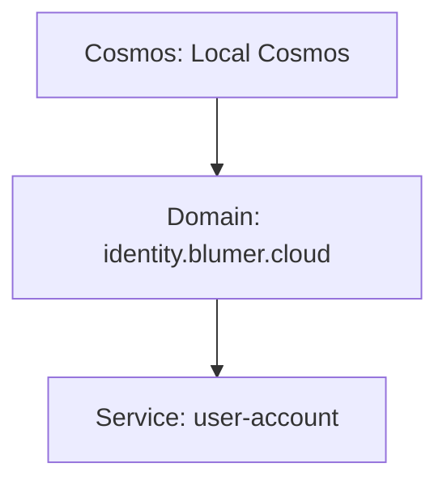

# CLI Usage (`nomos`)

Diese Seite dokumentiert die aktuelle Nutzung der Nomos-CLI auf Basis der implementierten Commands in `internal/cli/root.go`.

## Schnellstart

```bash
go run ./cmd/nomos --help
```

Version anzeigen:

```bash
go run ./cmd/nomos version
```

## Command-Übersicht

| Command | Beschreibung |
|---------|-------------|
| `nomos version [--short] [--format text\|json]` | CLI-Version anzeigen |
| `nomos cosmos init <path> [--git] [--force]` | Neues Cosmos-Repository initialisieren |
| `nomos cosmos info [--path] [--format]` | Cosmos-Metadaten anzeigen |
| `nomos cosmos doctor [--path]` | Basis-Gesundheitsprüfung |
| `nomos domain add <dns> [--path] [--owner] [--force]` | Domain anlegen |
| `nomos domain list [--path] [--format]` | Alle Domains auflisten |
| `nomos domain get <dns> [--path] [--format]` | Domain-Detail |
| `nomos domain delete <dns> [--path]` | Domain löschen |
| `nomos service add <name> --domain <dns> [--path] [--owner] [--force]` | Service anlegen |
| `nomos service list --domain <dns> [--path] [--format]` | Services einer Domain auflisten |
| `nomos service get <name> --domain <dns> [--path] [--format]` | Service-Detail |
| `nomos service delete <name> --domain <dns> [--path]` | Service löschen |
| `nomos blueprint list [--path] [--format]` | Alle Blueprints auflisten |
| `nomos blueprint show <id> [--path] [--format]` | Blueprint-Detail |
| `nomos blueprint create --id <id> --name <name> [--type] [--version] [--status] [--owner] [--summary] [--service-ref] [--service-blueprint-ref] [--path]` | Blueprint erstellen |
| `nomos blueprint delete <id> [--path]` | Blueprint löschen |
| `nomos blueprint validate <id> [--path] [--format]` | Blueprint validieren (nur Findings zu diesem Blueprint) |
| `nomos blueprint publish <id> [--path] [--format]` | Blueprint publizieren (status: draft → published) |
| `nomos instance list [--path] [--format] [--filter key=val,…]` | Instances auflisten (optional filtern) |
| `nomos instance show <id> [--path] [--format]` | Instance-Detail |
| `nomos instance create --id <id> --blueprint-ref <id> [--type] [--blueprint-version] [--name] [--owner] [--path] [--format]` | Instance erstellen |
| `nomos instance verify <id> [--path] [--format]` | Manual-Verification Evidence schreiben, compliance_status → compliant |
| `nomos servicegraph list [--path] [--format]` | Servicegraphs auflisten |
| `nomos servicegraph get <id> [--path] [--format]` | Servicegraph-Detail |
| `nomos servicegraph create <file.yaml> [--path]` | Servicegraph aus YAML-Datei erstellen |
| `nomos servicegraph delete <id> [--path]` | Servicegraph löschen |
| `nomos servicegraph validate <id> [--path]` | Servicegraph validieren |
| `nomos servicegraph mermaid <id> [--path]` | Mermaid-Diagramm ausgeben |
| `nomos servicegraph execution <id> [--path] [--format]` | Topologische Ausführungsreihenfolge ausgeben |
| `nomos namespace tree [--path] [--format]` | Namespace-Baum ausgeben |
| `nomos validate [--path] [--format]` | Vollständige Cosmos-Validierung |
| `nomos graph [--path] [--format]` | Mermaid-Graph des gesamten Cosmos |
| `nomos verify domain <dns> [--path]` | DNS-TXT-Verifikation durchführen |
| `nomos serve [--path] [--listen]` | Web-Server starten |

---

## Storage model

Nomos source repositories and Cosmos workspaces are intentionally separate. All mutable Nomos/Cosmos data in a workspace is stored below `.nomos/`, similar to `.git/`.

Dedicated Cosmos repository `.gitignore` recommendation:

```gitignore
.nomos/cache/
.nomos/index/
```

Local-only Nomos data inside another repository can ignore everything:

```gitignore
.nomos/
```

## `nomos cosmos`

### `nomos cosmos init <path>`
Erzeugt eine neue lokale Cosmos-Struktur.

**Erstellt u. a. folgende Pfade:**
- `<path>/.nomos/cosmos.yaml`
- `<path>/README.md`
- `<path>/.nomos/domains/`
- `<path>/.nomos/cache/`
- `<path>/.nomos/index/`
- `<path>/.nomos/evidence/`

**Flags:**
- `--force`: erlaubt Initialisierung in nicht-leerem Zielverzeichnis.
- `--git`: führt `git init` im Zielverzeichnis aus und erzeugt zusätzlich `.gitkeep`.

**Beispiel:**
```bash
go run ./cmd/nomos cosmos init ./my-cosmos --force
```

### `nomos cosmos info`
Liest `.nomos/cosmos.yaml` und gibt Kernfelder aus (`id`, `name`, `version`, `status`, `owner`, `domains`).
Die Domain-Anzahl wird aus dem Dateisystem ermittelt (`.nomos/domains/*/domain.yaml`) und nicht aus einem statischen Feld in `.nomos/cosmos.yaml`.

**Flag:**
- `--path` (Default: `.`)

### `nomos cosmos doctor`
Prüft Basiszustand:
- ob `.nomos/cosmos.yaml` existiert
- ob ein `.git`-Ordner vorhanden ist

**Ausgabeverhalten:**
- Fehler bei fehlender `.nomos/cosmos.yaml` (Exit-Code 1)
- Warnung, wenn Git nicht initialisiert ist

---

## `nomos domain`

The CLI keeps the existing explicit canonical-name workflow. In the web UI, normal domain creation is more guided: select a parent node and enter only the new segment. Nomos composes the canonical namespace. Advanced mode allows full canonical input.

Example web flow:

```text
Selected parent: blumer.cloud
New segment: test2
Created domain: test2.blumer.cloud
```

### `nomos domain add <dns>`
Erzeugt eine Domain unter `.nomos/domains/<dns>/`.

**Validierung:**
- DNS-Name muss mindestens einen Punkt enthalten (`.`), sonst Fehler.

**Erstellt:**
- `.nomos/domains/<dns>/domain.yaml`
- `.nomos/domains/<dns>/README.md`
- `.nomos/domains/<dns>/services/`

**Flags:**
- `--path` (Default: `.`)
- `--owner` (Default: `unknown`)
- `--force` (überschreibt vorhandene Domain-Struktur)

### `nomos domain list`
Listet alle Unterordner unter `.nomos/domains/`.

Flag: `--path` (Default: `.`).

---

## `nomos service`

The CLI keeps the explicit `--domain` flag. In the web UI, service creation is contextual: select a domain, choose **Add service**, enter the service name, and review the resulting `domain / services / name` preview.

### `nomos service add <name> --domain <dns>`
Erzeugt einen Service unter `.nomos/domains/<dns>/services/<name>/`.

**Erstellt Unterordner:**
- `capabilities/`
- `requirements/`
- `rules/`
- `processes/`
- `skills/`
- `findings/`
- `evidence/`

**Zusätzlich:**
- `service.yaml`
- `README.md`

**Flags:**
- `--domain` (**pflichtig**)
- `--path` (Default: `.`)
- `--owner` (Default: `unknown`)
- `--force`

---

## `nomos validate`

Führt eine vollständige, deterministische Validierung des gesamten Cosmos aus.

**Geprüft wird:**
1. Existenz von `.nomos/cosmos.yaml`
2. Blueprint-Pflichtfelder und typ-spezifische Regeln (product/service)
3. Instance-Pflichtfelder und erlaubte `compliance_status`-Werte
4. Servicegraph-Struktur (Node/Edge-Typen, Zyklen, Scope-Referenzen)
5. Cross-Artifact-Referenzen:
   - `namespace_service_ref` → Service existiert im Cosmos
   - `required_services[].service_blueprint_ref` → Service Blueprint existiert
   - `blueprint_ref` in Instances → Blueprint existiert
   - Instance-Type passt zum Blueprint-Type
   - `required_inputs` der Instance vollständig belegt
   - `evidence_requirements` der Instance abgedeckt

**Ausgabe:**
- Text (Standard): gruppiert nach Severity mit Suggestions
- JSON mit `--format json`: strukturierte Finding-Objekte mit `code`, `severity`, `message`, `path`, `artifact_type`, `artifact_id`, `suggestion`

**Exit-Codes:**

| Code | Bedeutung |
|------|-----------|
| `0` | Keine Findings **oder** nur Warnings/Info |
| `1` | Mindestens ein Finding mit `severity: error` |

```bash
# Standard-Ausgabe (Warnings sind OK, nur Errors blockieren)
nomos validate --path .

# JSON für CI / Scripting
nomos validate --path . --format json

# Nur Errors in CI
nomos validate --path . --format json | jq '.findings[] | select(.severity == "error")'

# Einzelnen Blueprint validieren
nomos blueprint validate <id> --path .
```

---

## `nomos graph`

Liest die Cosmos-Struktur aus dem Dateisystem und gibt eine Mermaid-Graph-Definition auf stdout aus:
- Cosmos-Knoten
- Domain-Knoten aus `.nomos/domains/*/domain.yaml`
- Service-Knoten aus `.nomos/domains/<domain>/services/*/service.yaml`

Beispielausgabe:



---

## `nomos blueprint`

### `nomos blueprint validate <id>`
Validiert einen einzelnen Blueprint. Gibt nur Findings aus, die sich auf diesen Blueprint beziehen (aus dem Full-Cosmos-Validate gefiltert).

**Exit-Codes:** 0 = keine Errors, 1 = Error-Findings vorhanden.

### `nomos blueprint publish <id>`
Setzt den `status` eines Blueprints von `draft` auf `published`.

```bash
nomos blueprint publish PB-ACC-001 --path .
nomos blueprint publish PB-ACC-001 --path . --format json
```

---

## `nomos instance`

### `nomos instance create`
Erstellt eine neue Instance aus einem Blueprint.

**Pflichtflags:** `--id`, `--blueprint-ref`

```bash
nomos instance create \
  --id PI-001 \
  --blueprint-ref PB-ACC-MBX-001 \
  --type product_instance \
  --blueprint-version 0.1.0 \
  --owner "Platform Team" \
  --path .
```

### `nomos instance verify <id>`
Schreibt einen Manual-Verification Evidence-Eintrag in die Instance-YAML und setzt `compliance_status: compliant`.

```bash
nomos instance verify PI-001 --path .
nomos instance verify PI-001 --path . --format json
```

### `nomos instance list --filter`
Filtert Instances nach `key=value`-Paaren (kommagetrennt).

Unterstützte Filterkeys: `status`, `compliance_status`, `blueprint_ref`, `type`.

```bash
nomos instance list --path . --filter status=active
nomos instance list --path . --filter compliance_status=compliant,type=product_instance
```

---

## `nomos servicegraph`

### `nomos servicegraph list`
Listet alle Servicegraphs im Catalog auf.

### `nomos servicegraph get <id>`
Zeigt Detailinfos zu einem Servicegraph (Nodes, Edges, Rules, Varianten).

### `nomos servicegraph create <file.yaml>`
Erstellt einen neuen Servicegraph aus einer YAML-Datei.

```bash
nomos servicegraph create ./my-graph.yaml --path .
```

### `nomos servicegraph delete <id>`
Löscht einen Servicegraph.

### `nomos servicegraph validate <id>`
Validiert die Struktur eines Servicegraphs (Typen, Zyklen, Scope-Referenzen).

### `nomos servicegraph mermaid <id>`
Gibt ein Mermaid-Flowchart-Diagramm des Servicegraphs auf stdout aus.

```bash
nomos servicegraph mermaid SG-001 --path . | pbcopy
```

### `nomos servicegraph execution <id>`
Gibt die topologisch sortierte Ausführungsreihenfolge als Gruppen aus (parallele Gruppen auf gleicher Ebene).

```bash
nomos servicegraph execution SG-001 --path .
nomos servicegraph execution SG-001 --path . --format json
```

---

## `nomos verify`

### `nomos verify domain <dns>`
Prüft DNS-TXT-Record `_nomos.<dns>` auf den Inhalt `nomos-domain=<dns>`.

**Nebenwirkung:**
- schreibt ein Evidence-File nach `.nomos/evidence/<dns>-dns.yaml`

**Statuslogik:**
- `verified`, wenn erwarteter TXT-Inhalt gefunden wurde
- sonst `failed` und Befehl endet mit Fehler

**Flag:**
- `--path` (Default: `.`)

---

## `nomos serve`

Startet einen HTTP-Server.

**Flags:**
- `--path` (Default: `.`)
- `--listen` (Default: `127.0.0.1:7373`)

**Environment:**
- `NOMOS_DOMAIN` – Öffentliche Domäne, unter der der lokale Server im Cosmos
  Explorer erscheint (z. B. `nomos.blumer.cloud`). Ohne diese Variable wird der
  Maschinen-Hostname verwendet – in einem Container ist das die Container-ID
  (z. B. `56afaec69c76`). Eine echte DNS-Domäne wird in der DNS-Hierarchie
  einsortiert (cloud → blumer → nomos) statt unter `local`.

**Endpoints:**
- `GET /health` → `{ "status": "ok", "service": "nomos", "version": "..." }`
- `GET /api/v1/validate` → `{ "status": "ok" }`

---

## Typische Workflow-Beispiele

### 1) Neues Cosmos-Repository erzeugen
```bash
go run ./cmd/nomos cosmos init ./demo-cosmos
cd ./demo-cosmos
go run ../cmd/nomos cosmos doctor --path .
```

### 2) Domain und Service anlegen
```bash
go run ./cmd/nomos domain add example.com --path . --owner platform-team
go run ./cmd/nomos service add identity-api --domain example.com --path . --owner iam-team
```

### 3) Validieren und Graph ausgeben
```bash
go run ./cmd/nomos validate --path .
go run ./cmd/nomos graph --path .
```

## `nomos version`

Supports multiple output modes:

```bash
nomos version
nomos version --short
nomos version --format text
nomos version --format json
```

Notes:
- `--format` supports `text` and `json`.
- Invalid formats (for example `--format xml`) return an error.
- If `--short` and `--format` are both set, `--short` wins and only the version string is printed.

## Web UI
Run `./bin/nomos serve --path /tmp/nomos-demo --listen 127.0.0.1:7373`.

### Go Web UI (read-only)

`nomos serve` also provides a read-only web interface rendered by embedded Go templates and static assets. It intentionally mirrors the Nomos frontend design language and does not require a separate Node/Vite build chain.

```bash
make build
COSMOS_PATH=/tmp/nomos-demo NOMOS_BIN=./bin/nomos ./scripts/create-demo-cosmos.sh
./bin/nomos serve --path /tmp/nomos-demo --listen 127.0.0.1:7373
```

---

## OpenAPI and Swagger documentation

When `nomos serve` is running, the Go HTTP server exposes machine-readable and interactive API documentation:

- `GET /openapi.json` returns the OpenAPI 3.1 document for the Nomos HTTP API.
- `GET /swagger` opens Swagger UI backed by `/openapi.json`.
- `GET /api/docs` is an alias for the Swagger UI.
- The human API index at `/api` links to both the Swagger UI and the OpenAPI JSON document.

Example:

```bash
./bin/nomos serve --path /tmp/nomos-demo --listen 127.0.0.1:7373
open http://127.0.0.1:7373/swagger
```

---

## CLI and REST API consistency

The read-only CLI and REST API are adapters over the same internal application DTOs for Cosmos, domains, services, validation, graph output and namespace trees.

| CLI command | REST endpoint | Web page |
| --- | --- | --- |
| `nomos cosmos info --format json` | `GET /api/v1/cosmos` | `/cosmos` |
| `nomos domain list --format json` | `GET /api/v1/domains` | `/domains` |
| `nomos domain get <domain> --format json` | `GET /api/v1/domains/{domain}` | `/domains/{domain}` |
| `nomos domain add <dns>` | `POST /api/v1/domains` | `/domains` form |
| `nomos domain delete <dns>` | `DELETE /api/v1/domains/{domain}` | — |
| `nomos service list --domain <d>` | `GET /api/v1/domains/{domain}/services` | `/services` |
| `nomos service get <name> --domain <d>` | `GET /api/v1/domains/{domain}/services/{service}` | `/services` detail |
| `nomos service add <name> --domain <d>` | `POST /api/v1/domains/{domain}/services` | `/services` form |
| `nomos service delete <name> --domain <d>` | `DELETE /api/v1/domains/{domain}/services/{svc}` | — |
| `nomos blueprint list` | `GET /api/v1/blueprints` | `/blueprints` |
| `nomos blueprint show <id>` | `GET /api/v1/blueprints/{id}` | `/blueprints/{id}` |
| `nomos blueprint create` | `POST /api/v1/blueprints` | — |
| `nomos blueprint delete <id>` | `DELETE /api/v1/blueprints/{id}` | — |
| `nomos blueprint validate <id>` | `GET /api/v1/blueprints/{id}/validate` | — |
| `nomos blueprint publish <id>` | `POST /api/v1/blueprints/{id}/publish` | — |
| *(field update)* | `PATCH /api/v1/blueprints/{id}` | — |
| `nomos instance list` | `GET /api/v1/instances` | `/instances` |
| `nomos instance show <id>` | `GET /api/v1/instances/{id}` | `/instances/{id}` |
| `nomos instance create` | `POST /api/v1/instances` | — |
| `nomos instance verify <id>` | `POST /api/v1/instances/{id}/verify` | — |
| `nomos instance delete <id>` | `DELETE /api/v1/instances/{id}` | — |
| *(field update)* | `PATCH /api/v1/instances/{id}` | — |
| `nomos servicegraph list` | `GET /api/v1/servicegraphs` | — |
| `nomos servicegraph get <id>` | `GET /api/v1/servicegraphs/{id}` | — |
| `nomos servicegraph create <file>` | `POST /api/v1/servicegraphs` | — |
| `nomos servicegraph delete <id>` | `DELETE /api/v1/servicegraphs/{id}` | — |
| `nomos servicegraph mermaid <id>` | `GET /api/v1/servicegraphs/{id}/mermaid` | — |
| `nomos servicegraph execution <id>` | `GET /api/v1/servicegraphs/{id}/execution` | — |
| `nomos graph` | `GET /api/v1/graph` | `/graph` |
| `nomos validate --format json` | `GET /api/v1/validate` | `/validate` |
| `nomos namespace tree --format json` | `GET /api/v1/namespaces` | `/namespaces` |
| `nomos verify domain <dns>` | `POST /api/v1/verify/domain/{dns}` | `/verify` |
| — | — | `/requirements` |
| — | — | `/rules` |

`--format` supports `text` and `json` where available. Invalid values return the shared `INVALID_FORMAT` error code.

## Canonical namespaces and tree display

Nomos keeps DNS-like domain identifiers as the canonical technical namespace:

```text
identity.blumer.cloud
```

The canonical name remains the filesystem and route identifier:

```text
.nomos/domains/identity.blumer.cloud/
.nomos/domains/identity.blumer.cloud/services/user-account/
GET /api/v1/domains/identity.blumer.cloud
```

For human presentation, explorer UIs and client navigation metadata reverse only the domain namespace into tree order:

```text
cloud / blumer / identity
```

Example namespace JSON metadata:

```json
{
  "canonical": "identity.blumer.cloud",
  "parts": ["identity", "blumer", "cloud"],
  "treeParts": ["cloud", "blumer", "identity"],
  "treePath": "cloud/blumer/identity",
  "displayPath": "cloud / blumer / identity",
  "leaf": "identity"
}
```

Services are not reversed. They are displayed below their canonical domain leaf in namespace tree output.

## Read-only API endpoints

- `GET /api/v1/cosmos` returns Cosmos summary metadata and deterministic domain/service counts.
- `GET /api/v1/domains` returns sorted domains with namespace metadata.
- `GET /api/v1/domains/{domain}` returns one domain plus sorted services.
- `GET /api/v1/domains/{domain}/services` returns the services for one canonical domain.
- `GET /api/v1/domains/{domain}/services/{service}` returns one service.
- `GET /api/v1/namespaces` returns the tree-oriented namespace representation rooted at the local Cosmos.
- `GET /api/v1/graph` returns Mermaid as `text/plain` by default.
- `GET /api/v1/graph?format=json` returns `{ "format": "mermaid", "content": "..." }`.
- `GET /api/v1/validate` returns the validation DTO.

Shared error codes include `COSMOS_MISSING`, `COSMOS_LOAD_FAILED`, `DOMAIN_NOT_FOUND`, `SERVICE_NOT_FOUND`, `VALIDATION_FAILED`, `INVALID_FORMAT`, `INVALID_NAMESPACE` and `INTERNAL_ERROR`.

## Web UI coverage

The Go-served web UI is available through `nomos serve` and is intended to be the primary human-facing interface for the local Cosmos repository:

```bash
./bin/nomos serve --path /tmp/nomos-demo --listen 127.0.0.1:7373
```

The UI is server-rendered from embedded Go templates and static assets. It reuses `internal/app` DTOs and application functions for reads, creation, validation, graph, namespace, blueprint, instance, doctor, and verification operations.

| CLI command | API endpoint | Web page |
|---|---|---|
| `nomos cosmos info` | `/api/v1/cosmos` | `/cosmos` |
| `nomos cosmos doctor` | TBD/app doctor endpoint | `/cosmos` |
| `nomos domain list` | `/api/v1/domains` | `/domains` |
| `nomos domain get` | `/api/v1/domains/{domain}` | `/domains/{domain}` |
| `nomos domain add` | `POST /api/v1/domains` | `/domains` form |
| `nomos service list` | `/api/v1/domains/{domain}/services` | `/services` |
| `nomos service get` | `/api/v1/domains/{domain}/services/{service}` | `/services` detail |
| `nomos service add` | `POST /api/v1/domains/{domain}/services` | `/services` form |
| `nomos validate` | `/api/v1/validate` | `/validate` |
| `nomos graph` | `/api/v1/graph` | `/graph` |
| `nomos namespace tree` | `/api/v1/namespaces` | `/namespaces` |
| `nomos verify domain` | TBD | `/verify` |
| `nomos blueprint list` | `/api/v1/blueprints` | `/blueprints` |
| `nomos blueprint show` | `/api/v1/blueprints/{id}` | `/blueprints/{id}` |
| `nomos instance list` | `/api/v1/instances` | `/instances` |
| `nomos instance show` | `/api/v1/instances/{id}` | `/instances/{id}` |
| `nomos instance compliance` | `/api/v1/instances/{id}/compliance` | `/instances/{id}` |

### Read-only and write operations

Read-only pages: dashboard, Cosmos metadata/doctor, namespace tree, graph, validation, blueprints, instances, API index, and verification evidence listing.

Write/create operations: domain creation and service creation are supported through UI forms and explicit POST endpoints. Domain verification can be triggered from `/verify`; it performs DNS TXT lookup and writes evidence in `.nomos/evidence` using the CLI-compatible format.

Known limitations: the doctor function currently lives in the application layer rather than as a dedicated public API endpoint, and verification does not yet expose a stable read endpoint beyond the `/verify` page.

### Domain-owned products and fulfillment validation

`nomos validate --path <cosmos>` now reports missing or unresolved product offering domains, service ownership, and fulfillment service references. Product blueprint JSON from `nomos blueprint list --format json` and `nomos blueprint show --format json` includes `offered_by`, `owning_domain`, and `fulfillment.required_services[].resolution_status`. Service JSON includes `owned_by`, `operated_by`, `capabilities`, and `supported_products` when present.

## Domain-owned product offering workflow

The REST/app DTOs now expose product offerings from the domain perspective. `GET /api/v1/domains/{domain}` includes products offered by the domain and services owned by or contained in it. Product files remain catalog blueprints, and the catalog endpoint remains a global index.

Useful endpoints:

- `GET /api/v1/domains/{domain}/products` lists product offerings for a domain.
- `POST /api/v1/domains/{domain}/products` creates a product with `offered_by` set from the domain path and `owning_domain` defaulted to the domain.
- `POST /api/v1/products/{id}/fulfillment-services` appends a required fulfillment service ref.
- `GET /api/v1/services/refs` lists canonical service refs for forms and automation.
